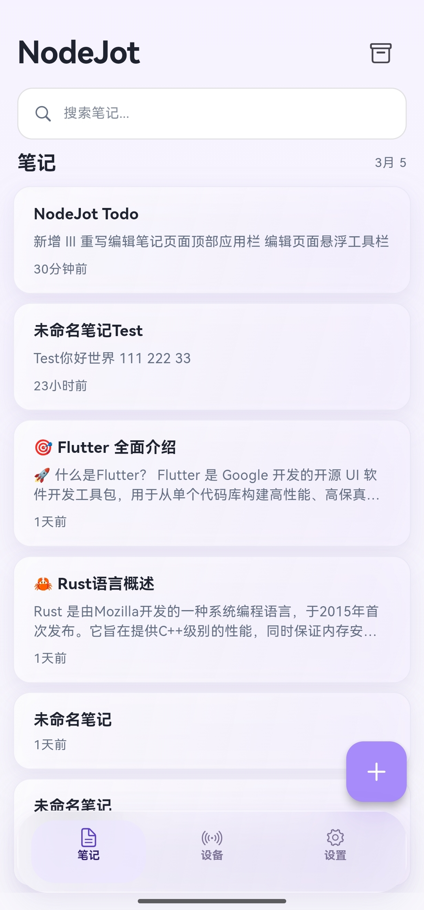
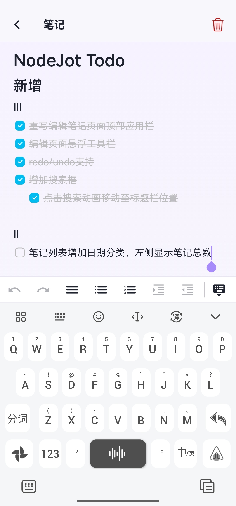
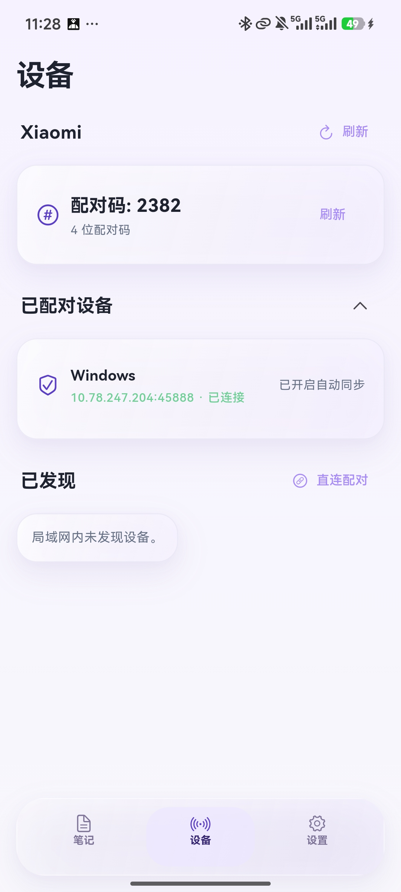
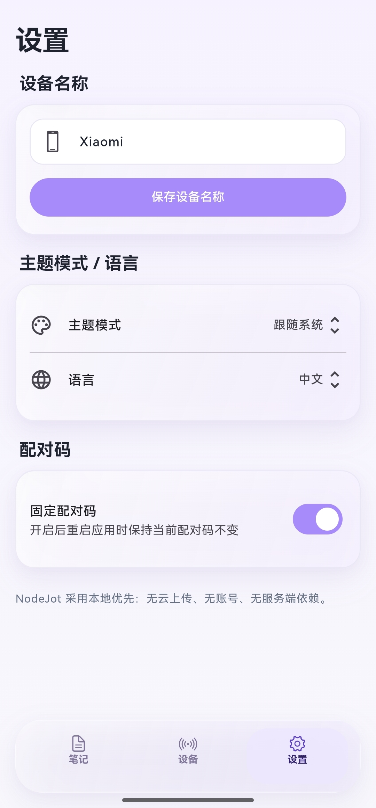

# NodeJot

Local-first note app with LAN multi-device sync (Android / iOS / Windows).

[简体中文](./README.md) | English

## Overview

NodeJot is a note app without cloud upload and account system, focused on multi-device sync within a local network.

- Data is stored locally by default
- Cross-platform interoperability (Android / iOS / Windows)
- Sync notes over LAN after device pairing

## Use Cases

- Share notes across multiple devices at home or office
- Avoid cloud accounts and third-party servers
- Work offline and sync automatically after reconnecting

## Main Features

- Notes: create, edit, delete, archive, undo delete
- LAN discovery: automatically find devices in the same subnet
- Secure pairing: connect devices with a 4-digit pairing code
- Device management: view paired devices, remove pairing, set alias
- Cross-device sync: sync note content between paired devices
- Editing experience: Markdown-friendly input and mobile quick toolbar

## UI Preview

> Screenshot placeholders. After you put images into the exact paths, GitHub will render them automatically.

| Notes List | Note Editor | Devices Page |
|---|---|---|
|  |  |  |

| Settings Page |  |  |
|---|---|---|
|  |  |  |

## Getting Started (3 Steps)

1. Open the app and check the local pairing code on the **Devices** page  
2. Enter that code on another device to complete pairing  
3. Go back to notes and start editing; content will sync between connected devices

## FAQ

### 1. Does NodeJot upload my notes to the cloud?
No. NodeJot does not provide cloud upload or account system by default.

### 2. Why can't one device discover another?
Make sure both devices are on the same LAN and local network access is allowed.  
Also check whether Windows Firewall is disabled.

### 3. Is sync automatic?
After pairing, you can enable auto-sync in settings, or trigger sync manually.

## Privacy & Security

- No account system and no cloud upload
- Notes are stored locally by default
- Device communication is based on LAN and pairing keys

## Supported Platforms

- Android
- Windows

## Known Limitations

- Currently text notes only
- Attachment/image sync is not supported yet
- LAN-only sync, no public internet direct connection

## Feedback

Feel free to submit issues and suggestions via GitHub Issues.
