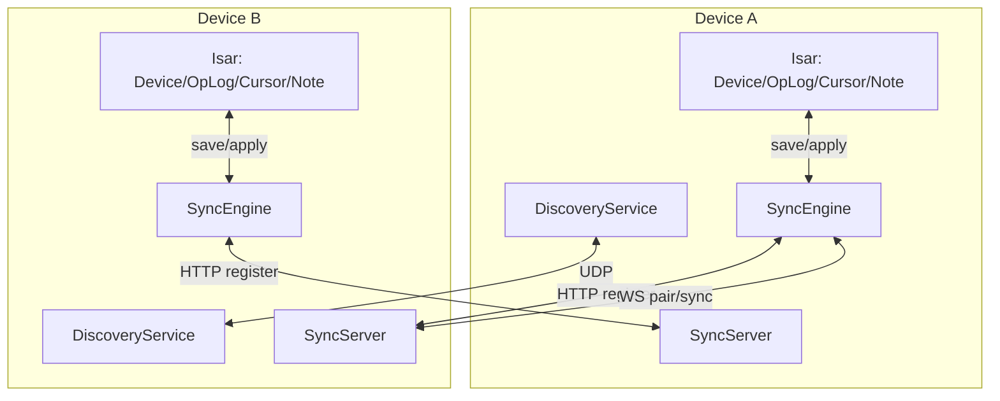

# 01. 架构与端口

## 1. 目标与范围

本文定义 NodeJot 网络模块的分层、组件职责、数据流边界和固定端口参数，作为后续各协议章节的前置说明。

## 2. 运行时组件

## 2.1 DiscoveryService（发现层）

- 负责 UDP 广播/组播的收发。
- 周期发送 `announce`、`probe`，接收 `probe_response`。
- 维护内存中的 `DiscoveredDevice` 列表。

代码锚点：
- `lib/domain/services/discovery_service.dart`

## 2.2 SyncServer（服务端入口）

- 监听 `syncPort`（45888）。
- 处理 `POST /register` 与 `POST /api/localsend/v2/register`。
- 处理 `GET /ws` 的 WebSocket 升级并路由消息到 `SyncEngine`。

代码锚点：
- `lib/domain/services/sync_server.dart`

## 2.3 SyncClient（客户端调用）

- 发起 HTTP register 请求（先兼容路径，再标准路径）。
- 发起 WebSocket 单次请求并等待单次响应。

代码锚点：
- `lib/domain/services/sync_client.dart`

## 2.4 SyncEngine（编排与状态机）

- 启动/关闭发现与服务端。
- 管理配对码、连接状态、自动同步调度。
- 路由并处理所有业务消息（pair/sync/settings）。

代码锚点：
- `lib/domain/services/sync_engine.dart`

## 2.5 CryptoService（安全层）

- 生成 X25519 密钥对。
- 派生共享密钥（HKDF）。
- 对已配对业务消息进行 AES-GCM 封装。

代码锚点：
- `lib/domain/services/crypto_service.dart`

## 3. 持久化模型与网络关系

| 模型 | 位置 | 作用 | 与网络关系 |
| --- | --- | --- | --- |
| `DeviceEntity` | `lib/data/isar/collections/device_entity.dart` | 已发现/已配对设备记录 | 保存 `host/port/publicKey/sharedKey/trusted` |
| `OpLogEntity` | `lib/data/isar/collections/op_log_entity.dart` | 操作日志 | 作为 `sync_request/sync_push` 的增量源 |
| `SyncCursorEntity` | `lib/data/isar/collections/sync_cursor_entity.dart` | 每对端游标 | 记录“已处理到对端 lamport” |
| `NoteEntity` | `lib/data/isar/collections/note_entity.dart` | 笔记快照 | `payload` 里的目标数据实体 |

## 4. 固定端口与定时参数

| 项目 | 值 | 说明 |
| --- | --- | --- |
| 同步服务端口 | `45888` | HTTP + WebSocket 复用 |
| UDP 发现端口 | `45890` | 全端统一 |
| 发现组播地址 | `239.255.42.99` | IPv4 multicast |
| announce 周期 | `3s` | 心跳公告 |
| probe 周期 | `4s` | 主动探测 |
| 发现清理周期 | `5s` | 清理过期设备 |
| 发现过期阈值 | `12s` | lastSeen 超时移除 |

代码锚点：
- `lib/core/constants/app_constants.dart`
- `DiscoveryService.start`
- `DiscoveryService._cleanupExpiredDevices`

## 5. 总体数据流

## 6. 当前实现边界

- 仅 IPv4；未实现 IPv6 发现链路。
- 仅局域网直连；未实现公网穿透。
- 仅“已配对设备”可进行加密同步。
- 未实现 CRDT/OT；并发编辑通过快照覆盖策略处理。

