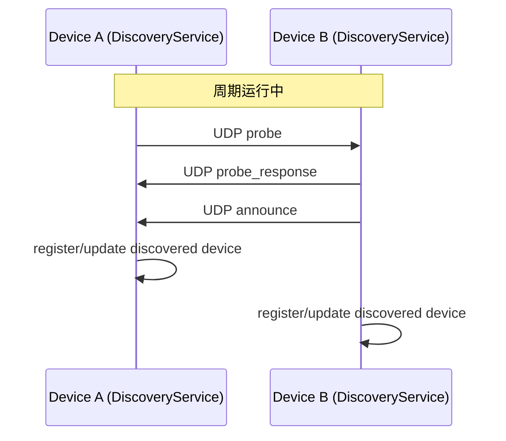

# 02. 设备发现（UDP）

## 1. 职责

`DiscoveryService` 通过 UDP 广播 + 组播机制维护“局域网在线设备列表”，并对外提供 `devicesStream`。

代码锚点：
- `lib/domain/services/discovery_service.dart`

## 2. Socket 初始化参数

在 `DiscoveryService.start()` 中：

- `RawDatagramSocket.bind(InternetAddress.anyIPv4, 45890, reuseAddress: true, reusePort: true)`
- `broadcastEnabled = true`
- `multicastLoopback = true`
- `readEventsEnabled = true`
- 尝试 `joinMulticast(239.255.42.99)`（失败仅日志告警）

设计目的：
- `reuseAddress/reusePort`：允许同机多实例/系统层复用端口（依平台策略）。
- `multicastLoopback=true`：本机可接收自己发往组播的报文（有助于调试与一致行为）。

## 3. 广播目标集合构建

`_rebuildBroadcastTargets()` 组合三类目标：

1. 全局广播：`255.255.255.255`
2. 固定组播：`239.255.42.99`
3. 各网卡定向广播：`x.x.x.255`

补充规则：
- 跳过非 IPv4 地址。
- 跳过链路本地 `169.254.x.x`。
- 若目标集合为空，兜底加回全局广播和组播。

## 4. 周期任务

在 `start()` 创建定时器：

- `_broadcastTimer`：每 `3s` 发送 `announce`
- `_probeTimer`：每 `4s` 发送 `probe`
- `_cleanupTimer`：每 `5s` 执行过期清理

在 `refreshNow()` 中执行一次“强化刷新”：

- 重建目标 -> 清理过期 -> `probe + announce`
- 延迟 200ms 后再次 `probe + announce`

目的：提高页面首次进入时的发现速度，减少“需要等待一个周期才看到设备”的体感。

## 5. 报文类型与处理分支

接收逻辑入口：`_onSocketEvent` -> `_handlePacket`

## 5.1 `probe`

- 若来自本机（`_isSelfPacket`）直接忽略。
- 否则：
  - 记录日志。
  - 向发送方定向发送 `probe_response`。
  - 立即额外发送一次 `announce`（加速互认）。

## 5.2 `announce` / `probe_response`

- 调用 `_registerDiscoveredDevice(payload, source)` 更新设备表。

## 5.3 其他类型

- 直接忽略，不抛错。

## 6. 发现报文字段（统一载荷）

发送由 `_sendPresencePacket(type)` 组装：

| 字段 | 类型 | 必填 | 说明 |
| --- | --- | --- | --- |
| `type` | string | 是 | `probe` / `announce` / `probe_response` |
| `deviceId` | string | 是 | 本机唯一标识 |
| `displayName` | string | 是 | 本机展示名 |
| `syncPort` | int | 是 | 对端后续 HTTP/WS 连接端口 |
| `publicKey` | string | 是 | 本机公钥（配对使用） |
| `timestamp` | string(ISO8601) | 是 | 发送时间戳 |

示例：

```json
{
  "type": "announce",
  "deviceId": "9fe447f4-2c6b-44a5-8b22-3c54d8aa92c1",
  "displayName": "NodeJot-9fe4",
  "syncPort": 45888,
  "publicKey": "base64-x25519-public-key",
  "timestamp": "2026-03-04T10:20:30.123Z"
}
```

## 7. 设备列表更新规则

在 `_registerDiscoveredDevice()`：

- 若 `deviceId` 缺失，丢弃。
- 若 `deviceId == local.deviceId`，丢弃（防自发现）。
- 以 `source.address` 作为 `host`（不信任 payload 的 host）。
- `port` 通过 `_readInt(payload['syncPort'])` 容错读取，失败回退 `45888`。
- 更新 `lastSeen=now`。

写入后的字段：
- `deviceId/displayName/host/port/publicKey/lastSeen`

## 8. 过期清理规则

`_cleanupExpiredDevices()`：

- 当前时间 - `lastSeen` > 12 秒，则从内存设备表删除。
- 若有删除行为，则推送新的设备流。

## 9. 时序图（典型发现）



## 10. 失败路径与容错

## 10.1 无效 datagram

- `jsonDecode` 异常会被捕获，写 warning 日志，不影响后续收包。

## 10.2 发送失败

- `_socket.send(...) <= 0` 时记录 warning，不抛异常。

## 10.3 joinMulticast 失败

- 仅告警，服务继续运行（仍可依赖广播目标）。

## 11. 与后续链路的接口

发现只解决“看到谁在线”，不代表信任关系。  
后续由 `SyncEngine` 完成：

- `DeviceRepository.upsertSeenDevice` 持久化发现信息
- register-back 回打
- 已配对设备探测、设置同步与数据同步

