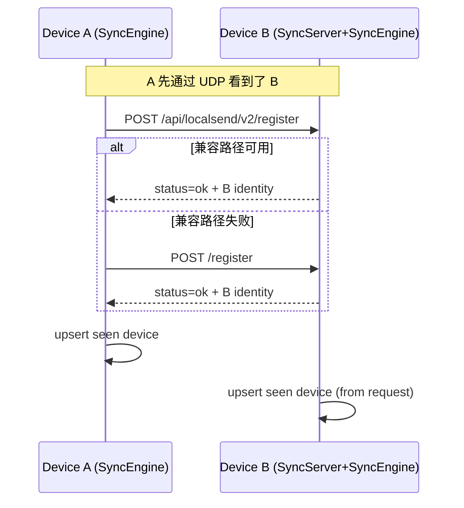

# 03. 设备注册（HTTP）

## 1. 目的

`register` 不是配对动作，而是“让双方都知道彼此可连”的登记动作。  
它主要解决某些网络环境下“只单向可见”的问题（如某端能发现对方，但对方列表暂时没有自己）。

## 2. 服务端入口

`SyncServer.start()` 支持两个注册路径：

- `POST /register`
- `POST /api/localsend/v2/register`（LocalSend 兼容路径）

代码锚点：
- `lib/domain/services/sync_server.dart`

请求若路径不匹配或方法不是 POST，则不走 register 逻辑。

## 3. 客户端调用策略

`SyncClient.register(...)` 的顺序：

1. 先请求 `/api/localsend/v2/register`
2. 若失败（异常）回退请求 `/register`

代码锚点：
- `lib/domain/services/sync_client.dart` (`register`, `_registerAtPath`)

## 4. register 请求/响应字段

## 4.1 请求体（JSON）

| 字段 | 类型 | 必填 | 说明 |
| --- | --- | --- | --- |
| `deviceId` | string | 是 | 发起方设备 ID |
| `displayName` | string | 是 | 发起方设备名 |
| `publicKey` | string | 是 | 发起方公钥 |
| `syncPort` | int | 是 | 发起方同步端口 |

示例：

```json
{
  "deviceId": "aa-bb-cc",
  "displayName": "NodeJot-aa12",
  "publicKey": "base64-public-key",
  "syncPort": 45888
}
```

## 4.2 成功响应

| 字段 | 类型 | 说明 |
| --- | --- | --- |
| `status` | string | 固定 `ok` |
| `deviceId` | string | 被请求方设备 ID |
| `displayName` | string | 被请求方设备名 |
| `publicKey` | string | 被请求方公钥 |
| `syncPort` | int | 被请求方同步端口 |

## 4.3 失败响应

| 字段 | 类型 | 说明 |
| --- | --- | --- |
| `status` | string | `error` |
| `message` | string | 错误描述 |

## 5. 服务端处理逻辑（SyncEngine）

`SyncEngine._handleRegister(payload, remoteAddress)`：

1. 校验 `deviceId/displayName/publicKey/syncPort` 都存在且端口可解析。
2. 调 `DiscoveryService.upsertDevice(...)` 回填发现列表。
3. 调 `DeviceRepository.upsertSeenDevice(...)` 落库（非 trusted）。
4. 返回本机身份信息（`status=ok`）。

若字段缺失：
- 返回 `{"status":"error","message":"invalid register payload"}`
- 记录 warning 日志。

代码锚点：
- `lib/domain/services/sync_engine.dart` (`_handleRegister`)

## 6. register-back 回打机制

在 `SyncEngine.start()` 订阅发现流后，对每个设备执行 `_registerBackIfNeeded(device)`。

节流规则：
- 同一个 `deviceId` 15 秒内最多回打一轮。

回打 payload 使用本机信息：
- `deviceId/displayName/publicKey/syncPort`

回打成功后：
- 将对端响应再次 `upsertDevice + upsertSeenDevice`，强化双向可见。

失败行为：
- 仅 warning 日志，不抛到 UI 层。

代码锚点：
- `SyncEngine._registerBackIfNeeded`

## 7. 时序图（register + register-back）



## 8. 与配对的关系

- register 只登记身份，不建立信任，不生成 sharedKey。
- 真正建立加密信道必须走 `pair_request`（见 04 章）。

