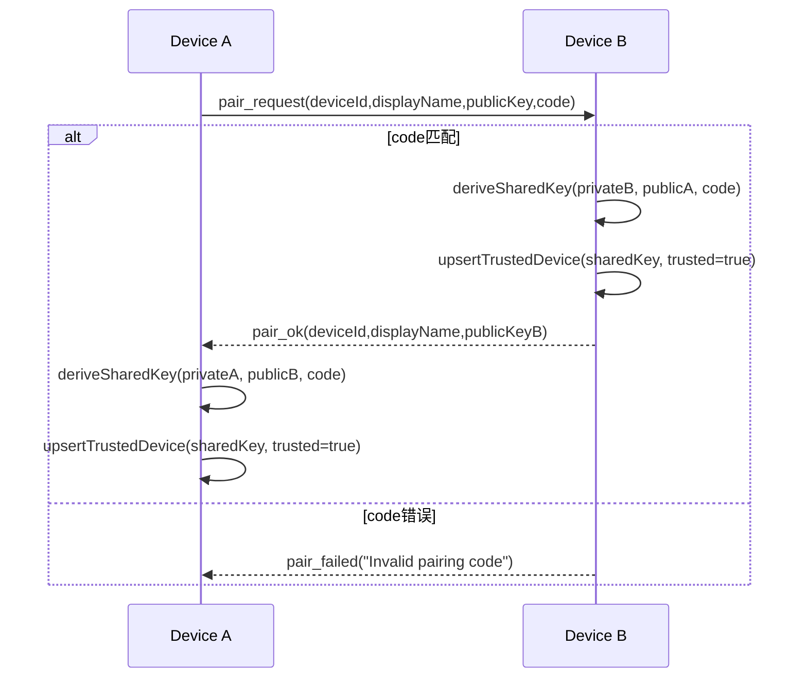

# 04. 配对与加密

## 1. 目标

配对阶段的目标是建立“已信任设备关系 + 共享密钥（sharedKey）”，为后续消息加密提供基础。

## 2. 本机身份与密钥来源

`LocalDeviceService.create()` 首次启动时会：

1. 生成本机 `deviceId`（UUID）
2. 生成 X25519 密钥对
3. 持久化到 `SharedPreferences`

后续启动直接读取本地持久化值。

代码锚点：
- `lib/domain/services/local_device_service.dart`
- `lib/domain/services/crypto_service.dart` (`generateX25519KeyPair`)

## 3. 配对码规则

- 配对码必须是 4 位数字（正则 `^\d{4}$`）。
- `SyncEngine.pairingCode` 运行时持有当前码。
- 若开启固定配对码，启动时使用持久化固定值，不自动轮换。

代码锚点：
- `SyncEngine._resolveInitialPairingCode`
- `SyncEngine._syncPairingCodeWithSettingsOnStart`
- `AppSettingsService` 固定配对码相关方法

## 4. 配对消息流程

## 4.1 发起方（客户端）

`SyncEngine.pairWithDevice(device, code)` 发送明文 WebSocket 消息：

```json
{
  "type": "pair_request",
  "deviceId": "<localDeviceId>",
  "displayName": "<localDisplayName>",
  "publicKey": "<localPublicKey>",
  "code": "1234"
}
```

## 4.2 接收方（服务端）

`_handlePairRequest(...)`：

1. 校验 `code == pairingCode.value`
2. 读取请求方 `deviceId/displayName/publicKey`
3. 用“本机私钥 + 对方公钥 + 配对码”派生 `sharedKey`
4. `upsertTrustedDevice(...)` 落库（`trusted=true`）
5. 确保设备级设置项存在（autoSync/oneTimeConnection）
6. 返回 `pair_ok`

失败响应：

```json
{
  "type": "pair_failed",
  "message": "Invalid pairing code"
}
```

成功响应：

```json
{
  "type": "pair_ok",
  "deviceId": "<remoteDeviceId>",
  "displayName": "<remoteDisplayName>",
  "publicKey": "<remotePublicKey>"
}
```

## 4.3 发起方收到 `pair_ok` 后

发起方同样执行 sharedKey 派生并 `upsertTrustedDevice`。  
至此双方都具备：

- 对方 `deviceId/publicKey`
- 共享密钥 `sharedKey`
- `trusted=true`

## 5. 共享密钥派生细节（CryptoService）

`deriveSharedKey(...)` 参数：

- `myPrivateKeyBase64`
- `remotePublicKeyBase64`
- `pairingCode`

算法流程：

1. X25519 计算共享密钥材料
2. HKDF-SHA256 派生 32 字节会话密钥
   - `salt = utf8("nodejot:<pairingCode>")`
   - `info = utf8("nodejot-sync-channel")`
3. Base64 编码后作为 `sharedKey`

## 6. secure_message 信封

配对成功后，重要业务消息通过 `secure_message` 封装。

字段：

| 字段 | 类型 | 说明 |
| --- | --- | --- |
| `type` | string | 固定 `secure_message` |
| `deviceId` | string | 发送方设备 ID |
| `nonce` | string(base64) | 12 字节随机 nonce |
| `cipherText` | string(base64) | AES-GCM 密文 |
| `mac` | string(base64) | GCM 鉴别标签 |

加密算法：
- AES-256-GCM（`AesGcm.with256bits()`）

代码锚点：
- `CryptoService.encryptEnvelope`
- `CryptoService.decryptEnvelope`

## 7. 加密边界（当前实现）

- 明文消息：
  - `pair_request`（配对前无法加密）
  - `register`（HTTP）
  - UDP 发现报文
- 加密消息（secure_message 内部 payload）：
  - `peer_status_request`
  - `peer_settings_apply`
  - `sync_request`
  - `sync_push`

`SyncEngine._onServerMessage()` 会先识别 `secure_message`，从本地 trusted 设备表拿 sharedKey 解密后再路由业务类型。

## 8. 安全失败路径

## 8.1 未信任设备发送 secure_message

- 服务端直接拒绝：
  - 返回 `{"type":"error","message":"Untrusted device"}`

## 8.2 配对码错误

- 返回 `pair_failed`
- 不会写入 trusted 设备

## 8.3 解密失败

- 由消息处理异常分支返回 `error`（日志记录）
- 不会执行后续业务动作

## 9. 时序图（配对 + 密钥建立）



