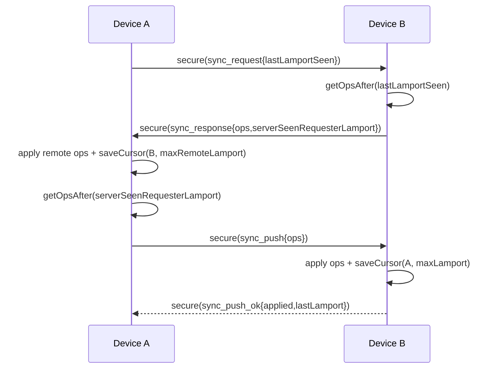

# 05. WebSocket 增量同步

## 1. 同步目标

在已配对设备之间同步笔记变更，保证多端数据最终一致。  
同步单位是操作日志 `SyncOperation`，由 Lamport 游标驱动增量拉推。

## 2. 前置条件

调用 `SyncEngine.syncWithDevice(device)` 前要求：

- 设备必须存在于 `DeviceRepository` 且 `trusted=true`
- 设备必须有 `sharedKey`

否则抛异常：`Device not paired yet.`

## 3. 同步入口

主要入口：

- 手动：`syncWithDevice` / `syncWithTrustedDevice`
- 自动：`_scheduleAutoSync`（本地用户保存后）
- 首次连通触发：`_syncOnConnectIfEnabled`

节流与串行：

- 防抖窗口：400ms
- `_autoSyncInFlight` 防并发
- `_autoSyncPending` 在飞行中累积下一轮

## 4. 双向同步协议

## 4.1 Step A -> B：`sync_request`

请求（先封装成 `secure_message`）内部 payload：

| 字段 | 类型 | 说明 |
| --- | --- | --- |
| `type` | string | `sync_request` |
| `requesterDeviceId` | string | 发起方设备 ID |
| `lastLamportSeen` | int | 发起方已处理到“对端”的 lamport |

B 端处理（`_handleSyncRequest`）：

1. 校验 requester 是否 trusted
2. 获取 `ops = getOpsAfter(lastLamportSeen)`
3. 读取 `serverSeenRequesterLamport`（B 端已处理到 A 的游标）
4. 返回 `sync_response`

返回字段：

| 字段 | 类型 | 说明 |
| --- | --- | --- |
| `type` | string | `sync_response` |
| `ops` | array | B->A 的增量操作列表 |
| `serverSeenRequesterLamport` | int | B 已确认处理到 A 的 lamport |

## 4.2 A 端应用拉取到的 ops

对每个 op：

1. `hasOp(opId)`：已存在则跳过（幂等）
2. `schemaVersion < 2`：跳过
3. `noteRepository.applyRemoteSnapshot(payload)` 尝试落库
4. 无论快照是否被判 stale，都会 `appendOperation(op)`（保持 op 可见）

应用后：
- 更新本地“看到 B 的游标”：`saveCursor(peerDeviceId, maxRemoteLamport)`

## 4.3 Step A -> B：`sync_push`

A 取本地操作：
- `localOps = getOpsAfter(serverSeenRequesterLamport)`

然后发送（secure_message 内 payload）：

| 字段 | 类型 | 说明 |
| --- | --- | --- |
| `type` | string | `sync_push` |
| `requesterDeviceId` | string | A 的设备 ID |
| `ops` | array | A->B 的操作增量 |

B 处理（`_handleSyncPush`）：

1. 校验 requester trusted
2. 逐条 `_applyRemoteOperation`
3. 维护 `maxLamport`
4. `saveCursor(requesterDeviceId, maxLamport)`
5. 返回 `sync_push_ok`

返回字段：

| 字段 | 类型 | 说明 |
| --- | --- | --- |
| `type` | string | `sync_push_ok` |
| `applied` | int | 实际插入 op 数 |
| `lastLamport` | int | B 记录的 requester 最新 lamport |

## 5. SyncOperation 结构

由 `SyncOperation.toMap()/fromMap()` 定义：

| 字段 | 类型 | 说明 |
| --- | --- | --- |
| `opId` | string | 全局唯一操作 ID（幂等键） |
| `lamport` | int | 逻辑时钟值 |
| `deviceId` | string | 操作来源设备 ID |
| `noteId` | string | 目标笔记 ID |
| `opType` | string | `create/update/delete` |
| `payload` | object | 笔记快照（schemaVersion>=2） |
| `createdAt` | string | ISO8601 |

## 6. Note 快照应用策略（LWW）

在 `NoteRepository.applyRemoteSnapshot` 中判定：

1. 若远端 `updatedAt` 更新，应用
2. 若 `updatedAt` 相同，比 `headRevision`，大者应用
3. 若都相同，比 `lastEditorDeviceId` 字典序，大者应用

否则判定为 stale（`applied=false`）。

该策略是“最新写覆盖”，不是 CRDT 合并。

## 7. 删除同步

删除也是标准 op（`opType=delete`，payload 含 `deletedAt`）。  
因此删除会像普通更新一样通过 pull/push 广播到其他端，不依赖额外通道。

## 8. 完整时序图（pull + push）

## 9. 失败路径

## 9.1 requester 未信任

- `sync_request` / `sync_push` 都会返回：
  - `{"type":"sync_error","message":"Requester is not trusted"}`

## 9.2 push/pull 返回类型异常

- 发起方收到非期望类型会抛异常：
  - `Sync request failed`
  - `Sync push failed`

## 9.3 schema 不支持

- `schemaVersion < 2` 的 op 直接跳过，不落库。

## 10. 代码锚点

- `SyncEngine.syncWithDevice`
- `SyncEngine._handleSyncRequest`
- `SyncEngine._handleSyncPush`
- `SyncEngine._applyRemoteOperation`
- `OpLogRepository.getOpsAfter/appendOperation/hasOp`
- `SyncCursorRepository.getLastLamportSeen/saveCursor`
- `NoteRepository.applyRemoteSnapshot`

