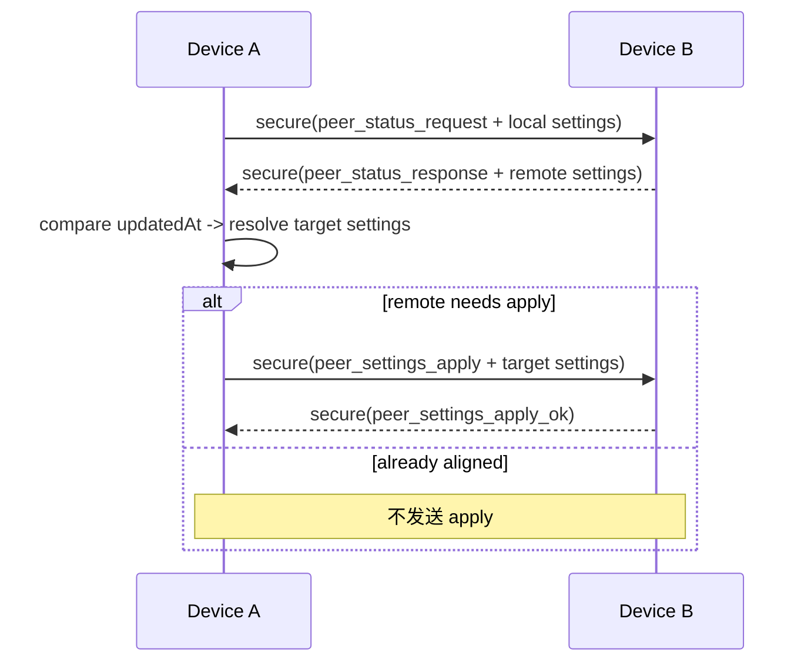

# 06. 已配对设备设置同步

## 1. 背景

已配对设备之间需要对齐两类设备级设置：

- 自动同步：`autoSyncEnabled`
- 一次性连接：`oneTimeConnectionEnabled`

这两个设置都带“最后修改时间”，按 latest-wins 合并。

## 2. 触发时机

触发点在 `_probeTrustedDevice()` 成功探测链路阶段：

1. 发送 `peer_status_request`
2. 比较双方设置更新时间
3. 必要时发送 `peer_settings_apply`

代码锚点：
- `SyncEngine._probeTrustedDevice`
- `SyncEngine._syncTrustedSettingsWithPeer`

## 3. 协议消息

## 3.1 `peer_status_request`

发送方（secure_message 内 payload）：

| 字段 | 类型 | 说明 |
| --- | --- | --- |
| `type` | string | `peer_status_request` |
| `requesterDeviceId` | string | 请求方设备 ID |
| `autoSyncEnabled` | bool | 本地自动同步状态 |
| `autoSyncUpdatedAtMs` | int | 本地自动同步修改时间（ms UTC） |
| `oneTimeConnectionEnabled` | bool | 本地一次性连接状态 |
| `oneTimeConnectionUpdatedAtMs` | int | 本地一次性连接修改时间（ms UTC） |

接收方响应 `peer_status_response`：

| 字段 | 类型 | 说明 |
| --- | --- | --- |
| `type` | string | `peer_status_response` |
| `autoSyncEnabled` | bool | 接收方当前值 |
| `autoSyncUpdatedAtMs` | int | 接收方更新时间 |
| `oneTimeConnectionEnabled` | bool | 接收方当前值 |
| `oneTimeConnectionUpdatedAtMs` | int | 接收方更新时间 |

## 3.2 `peer_settings_apply`

当请求方算出“目标统一值”且对端不一致时，下发：

| 字段 | 类型 | 说明 |
| --- | --- | --- |
| `type` | string | `peer_settings_apply` |
| `requesterDeviceId` | string | 下发方设备 ID |
| `autoSyncEnabled` | bool | 统一后的自动同步值 |
| `autoSyncUpdatedAtMs` | int | 统一后的更新时间 |
| `oneTimeConnectionEnabled` | bool | 统一后的一次性连接值 |
| `oneTimeConnectionUpdatedAtMs` | int | 统一后的更新时间 |

对端返回：

| 字段 | 类型 | 说明 |
| --- | --- | --- |
| `type` | string | `peer_settings_apply_ok` |
| `autoSyncEnabled` | bool | 已应用值 |
| `autoSyncUpdatedAtMs` | int | 已应用更新时间 |
| `oneTimeConnectionEnabled` | bool | 已应用值 |
| `oneTimeConnectionUpdatedAtMs` | int | 已应用更新时间 |

## 4. 合并策略（latest-wins）

在 `_syncTrustedSettingsWithPeer`：

1. 本地取 `localAutoSyncSetting/localOneTimeSetting`
2. 远端返回 `remoteAutoSync/remoteOneTime`
3. 对每个设置独立比较 `updatedAt`
4. 新时间胜出，产出 `targetXxx`

本地更新条件：
- 若远端更新时间更晚，则更新本地持久化值。

对端更新条件：
- 若对端值或更新时间与 `target` 不同，则发送 `peer_settings_apply`。

## 5. 服务端处理逻辑

## 5.1 处理 `peer_status_request`

`_handlePeerStatusRequest`：

- 校验 `requesterDeviceId` 存在且 trusted
- 确保设备配置存在（`ensureDeviceAutoSyncEnabled`、`ensureDeviceOneTimeConnectionEnabled`）
- 返回当前配置值与更新时间

## 5.2 处理 `peer_settings_apply`

`_handlePeerSettingsApply`：

- 校验 requester trusted
- 读取 payload 布尔值与 ms 时间
- 写入 `AppSettingsService.setDeviceAutoSyncEnabled(...)`
- 写入 `AppSettingsService.setDeviceOneTimeConnectionEnabled(...)`
- 返回 `peer_settings_apply_ok`

## 6. 与持久化的对应关系

持久化在 `AppSettingsService` 中，按设备 ID 存储：

- `app.settings.device_auto_sync.<deviceId>`
- `app.settings.device_auto_sync.updated_at.<deviceId>`
- `app.settings.device_one_time_connection.<deviceId>`
- `app.settings.device_one_time_connection.updated_at.<deviceId>`

并提供 `ValueListenable<bool>` 给 UI 订阅。

## 7. 失败路径

- requester 缺失：`{"type":"error","message":"Missing requesterDeviceId"}`
- requester 未信任：`{"type":"error","message":"Requester is not trusted"}`
- apply 返回非 `peer_settings_apply_ok`：探测链路抛异常，连接状态标记 `invalid`

## 8. 时序图

## 9. 实现现状说明

- 一次性连接配置已能跨端同步与持久化。
- “关闭应用后自动删除此配对”策略目前未在网络层/生命周期层自动执行，只是配置项已具备。

