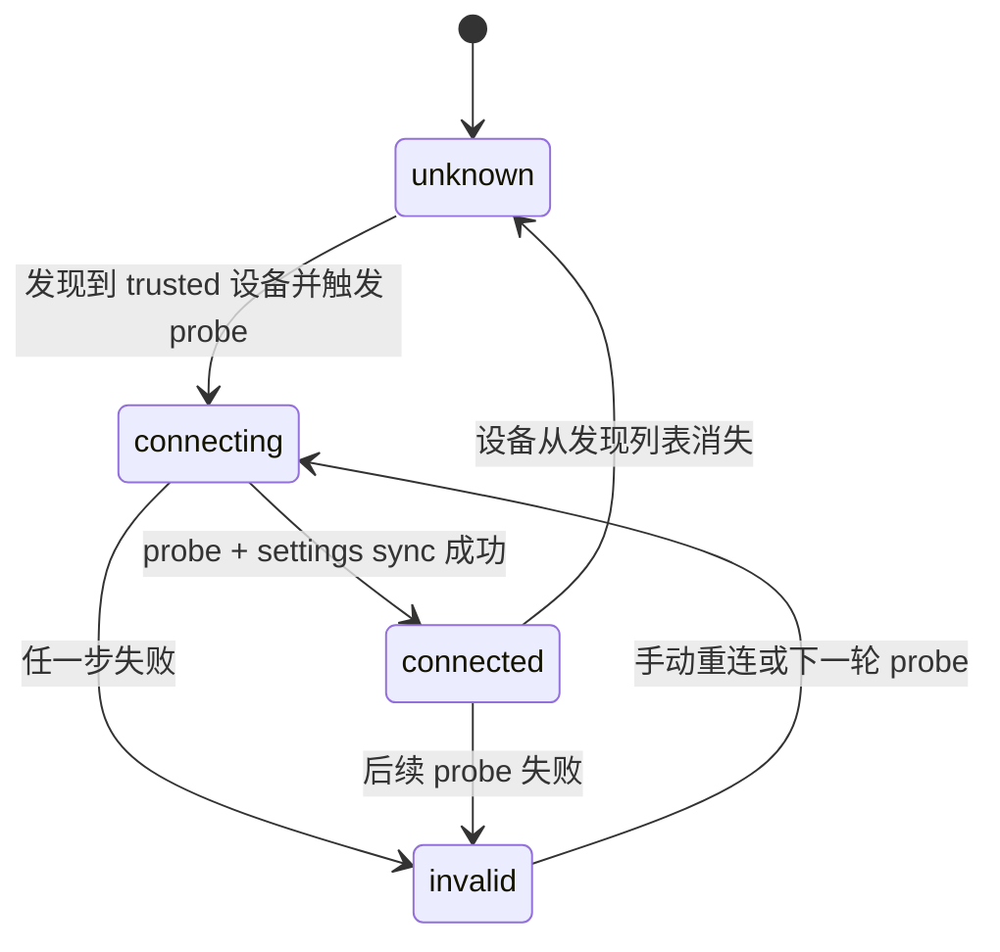

# 07. 连接状态与可靠性

## 1. 状态定义

`TrustedDeviceConnectionState` 枚举：

- `unknown`：未探测/离线/发现列表消失后的未确认状态
- `connecting`：探测中
- `connected`：探测和设置同步成功
- `invalid`：探测失败（常见为配对失效或链路不可达）

代码锚点：
- `lib/domain/services/sync_engine.dart`

## 2. 状态转移规则

## 2.1 发现到已配对设备

- 当发现流中出现 trusted 设备：
  - 若满足节流条件，触发 `_probeTrustedDevice`
  - 进入 `connecting`

## 2.2 探测成功

- `peer_status` 与必要的 `peer_settings_apply` 全部成功后：
  - 状态置为 `connected`

## 2.3 探测失败

- 任一步异常：
  - 状态置为 `invalid`
  - 清除“已执行首次自动同步”标记

## 2.4 设备离线

- 发现列表中不再包含该 trusted 设备 ID 时：
  - 若原状态为 `connected/connecting`，回落到 `unknown`

## 3. 状态机图

## 4. 防抖/节流/去重机制

## 4.1 trusted probe 节流

- 同一设备 8 秒内只做一次 probe（除 `force=true`）
- 防止状态在 `connecting/connected` 之间频繁抖动

## 4.2 register-back 节流

- 同一设备 15 秒内只做一次 register-back

## 4.3 自动同步串行化

- `_autoSyncInFlight=true` 时新触发只置 `_autoSyncPending=true`
- 当前轮结束后若 pending 仍为 true，再执行下一轮
- 避免并发拉推导致游标与日志竞争

## 4.4 connect-once 自动同步保护

- `_connectAutoSyncedDeviceIds` 集合保证“每次连通仅自动同步一次”
- 连接失效后会移除，允许下次重新连通再触发

## 5. 可靠性设计细节

## 5.1 发现可靠性

- 广播 + 组播 + 定向广播三轨并发发包
- `refreshNow` 双次探测提高首次发现概率

## 5.2 通信可靠性

- WebSocket/HTTP 调用都有超时（客户端默认 8s/5s）
- 请求失败不会崩溃主循环，记录日志并在下一轮重试

## 5.3 同步幂等性

- `opId` 唯一约束 + `hasOp` 检查，保证重复包不会重复应用

## 5.4 最终一致性

- 通过游标推进和后续轮询/触发同步实现最终一致性
- 非 CRDT，不保证中间态无覆盖

## 6. 常见状态异常与含义

| 现象 | 含义 | 常见原因 |
| --- | --- | --- |
| 一直 `connecting` | probe 长时间未完成 | 网络不通、对端未监听、加密握手失败 |
| `connected` 与 `invalid` 反复跳 | 链路间歇可达 | Wi-Fi 切换、设备休眠、端口瞬断 |
| 长期 `unknown` | 发现层未看到设备 | 广播受限、不同网段、虚拟机网络隔离 |

## 7. 代码锚点

- `SyncEngine._probeTrustedDevice`
- `SyncEngine._setTrustedConnectionState`
- `SyncEngine._syncOnConnectIfEnabled`
- `SyncEngine._scheduleAutoSync`
- `SyncEngine.refreshDiscovery`

