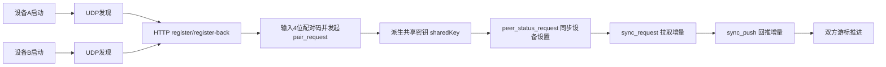

# NodeJot 网络通信文档总览

本目录描述 NodeJot 当前网络实现（局域网内多端发现、配对、加密通信、增量同步）。

## 1. 文档目录

- [01 架构与端口](./01-architecture-and-ports.md)
- [02 设备发现（UDP）](./02-discovery-udp.md)
- [03 设备注册（HTTP）](./03-registration-http.md)
- [04 配对与加密](./04-pairing-and-crypto.md)
- [05 WebSocket 增量同步](./05-sync-over-websocket.md)
- [06 已配对设备设置同步](./06-peer-settings-sync.md)
- [07 连接状态与可靠性](./07-connection-state-and-reliability.md)
- [08 错误场景与排障](./08-error-cases-and-troubleshooting.md)
- [99 协议字典（字段级）](./99-wire-schema-reference.md)

## 2. 关键常量

| 常量 | 值 | 说明 | 代码锚点 |
| --- | --- | --- | --- |
| `AppConstants.syncPort` | `45888` | HTTP register + WebSocket `/ws` 服务端口 | `lib/core/constants/app_constants.dart` |
| `AppConstants.discoveryPort` | `45890` | UDP 发现端口 | `lib/core/constants/app_constants.dart` |
| `AppConstants.discoveryMulticastAddress` | `239.255.42.99` | IPv4 发现组播地址 | `lib/core/constants/app_constants.dart` |
| `AppConstants.discoveryBroadcastInterval` | `3s` | 周期发送 `announce` | `lib/core/constants/app_constants.dart` |
| `AppConstants.discoveryProbeInterval` | `4s` | 周期发送 `probe` | `lib/core/constants/app_constants.dart` |
| 设备过期 TTL | `12s` | 超过 12 秒未刷新则从发现列表移除 | `DiscoveryService._cleanupExpiredDevices` |
| 清理周期 | `5s` | 过期清理定时器周期 | `DiscoveryService.start` |

## 3. 传输层分工

| 层 | 协议 | 用途 | 入口 |
| --- | --- | --- | --- |
| 发现层 | UDP（广播+组播） | 探测在线设备与基础身份信息 | `DiscoveryService` |
| 建链层 | HTTP POST | register / register-back，提升双向可见性 | `SyncServer` + `SyncClient.register` |
| 同步层 | WebSocket | 配对、设置同步、增量同步 | `SyncServer` + `SyncClient.send` |
| 安全层 | `secure_message` | 已配对设备上的业务消息加密封装 | `CryptoService.encryptEnvelope/decryptEnvelope` |

## 4. 端到端主流程（高层）

## 5. 同步策略摘要（当前实现）

- 数据同步单位是 `SyncOperation`（包含 `opId`、`lamport`、`opType`、`payload`）。
- 本地保存会先落库，再写 `op_log`，然后按自动同步开关触发同步。
- 远端应用使用 **LWW 判定**（按 `updatedAt` -> `headRevision` -> `lastEditorDeviceId`）。
- 同步不做 CRDT/OT 合并，属于“最新快照覆盖”策略。

## 6. 代码锚点（总）

- `lib/core/constants/app_constants.dart`
- `lib/domain/services/discovery_service.dart`
- `lib/domain/services/sync_server.dart`
- `lib/domain/services/sync_client.dart`
- `lib/domain/services/sync_engine.dart`
- `lib/domain/services/crypto_service.dart`
- `lib/data/repositories/device_repository.dart`
- `lib/data/repositories/op_log_repository.dart`
- `lib/data/repositories/sync_cursor_repository.dart`
- `lib/data/repositories/note_repository.dart`

